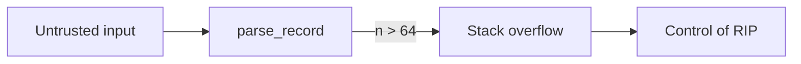

Welcome! This blog is where I publish write-ups on **vulnerability research** and **reverse engineering**.
This first post doubles as a reference for the formatting available in every article.

<!--more-->

## Code

Fenced code blocks get syntax highlighting, a copy button, and optional filenames and line highlights:

```c {filename="parser.c", hl_lines=[4]}
int parse_record(const uint8_t *buf, size_t len) {
    uint8_t tmp[64];
    uint16_t n = *(uint16_t *)buf;
    memcpy(tmp, buf + 2, n);   // n is attacker-controlled
    return process(tmp, n);
}
```

```nasm
mov  rdi, [rbp-0x18]
call strlen
cmp  rax, 0x40
ja   .too_long
```

## Callouts


  Useful context the reader should know.



  Something that can go wrong, like an unpatched version.



  Critical impact, like pre-auth remote code execution.


## Diagrams

Mermaid diagrams render straight from Markdown:



## Tabs


  
```python
payload = b"\x00\x02" + b"A" * 0x200
```
  
  
```bash
python3 -c 'import sys; sys.stdout.buffer.write(b"\x00\x02" + b"A"*0x200)' > crash.bin
```
  


## Collapsible sections


```text
==1234==ERROR: AddressSanitizer: stack-buffer-overflow on address 0x7ffd...
WRITE of size 512 at 0x7ffd... thread T0
    #0 0x4c3a2f in __asan_memcpy
    #1 0x5012ab in parse_record parser.c:4
```


## Tables

| Offset | Size | Field       |
|-------:|-----:|-------------|
| `0x00` | 2    | Length      |
| `0x02` | *n*  | Payload     |

## Math

Probability of hitting a 1-in-\( 2^{n} \) ASLR guess after \( k \) tries:

$$P = 1 - \left(1 - 2^{-n}\right)^{k}$$

## Images

Drop an image into the post's folder, next to `index.md`, and reference it by filename:
``. Click any image to zoom.
